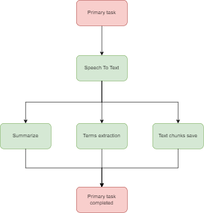

# Backend

Tech stack: NestJS + FastAPI + Celery

## GraphQL

To access GraphQL endpoint navigate to `/graphql` endpoint. 

## Celery

Task of lecture analysing is split into 4 tasks. 

**Speech to text** - the task everything starts from.

**Summarize** - extracts minimum

**Terms extraction** - extracts terms from text chunks

**Text chunks save** - simply saves text chunks
