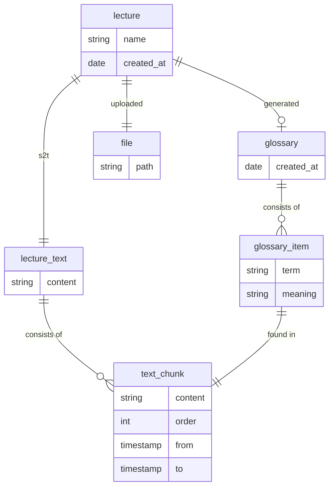

```mermaid
erDiagram

lecture {
    string name
    date created_at
}

glossary {
    date created_at
}

file {
    string path
}

glossary_item {
    string term
    string meaning
}

lecture_text {
    string content
}

text_chunk {
    string content
    int order
    timestamp from
    timestamp to
}

lecture ||--o| glossary: "generated"
glossary ||--o{ glossary_item: "consists of"
lecture ||--|| file: uploaded
lecture ||--|| lecture_text: s2t
lecture_text ||--o{ text_chunk: "consists of"
glossary_item ||--|| text_chunk: "found in"
```